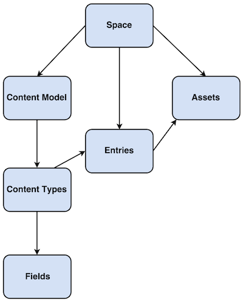
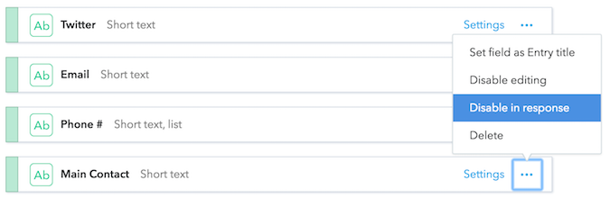

Contentful organizes content into _spaces_, that allows you to group all the related resources for a project together, this includes content entries, media assets, and settings for localizing content into different languages.

Each space has a _content model_ that represents the _content types_ you create.

Each _content type_ consists of a set of up to 50 fields that you define, these fields can be one of the following.

- **Text**: A short or long text field for titles, names, or paragraphs of text.
- **Number**: For storing integer or decimal numbers, such as prices, SKUs or quantities.
- **Date and time**: A timestamp value for storing date and time values such as opening hours or event start.
- **Location**: Coordinate values for storing the latitude and longitude of a physical location.
- **Media**: For referencing media files such as images, videos, and documents.
- **Boolean**: For storing values that have two states, e.g. Yes or no, true or false etc.
- **JSON object**: For storing any other types of objects you have defined.
- **Reference**: To model relationships between content, including other content types. For example, linking a blog to a category.

Fields also contain metadata, such as validations and widget appearance.

Contentful stores individual items of content as _entries_, which represent textual or structural information based on the content type used. Items can also be _assets_, which are binary files, such as images, videos or documents. Assets have three fixed fields, the name, description and attached file.

You can see how Contentful represents your content model in JSON by clicking the _JSON preview_ tab next to _the_ fields tab.

If you want to hide fields from appearing in JSON output, you can disable it by clicking the three dots to the right of the field.

This is useful for content information that is important to writers and editors, but not for public consumption.

## Example - modeling a product catalogue

One of the template spaces in Contentful is for a product catalogue, it consists of:

- **A Category**: What product type is it?
- **A Brand**: Who made the product?
- **A Product**: An item for sale that references a _category_ and a _brand_.

And for example, the **Brand** content type consists of the following fields:

- **Company Name**: This is the title of the entry, it's a required field, with the _Single line_ appearance setting.
- **Logo**: A media field that references assets.
- **Description**: Describes the brand, it's a longer text field with the Markdown editor enabled.
- **Website, Twitter, Email**: Three text fields that hold the contact details for the brand. They have validation rules to ensure the correct contact information.
- **Phone #**: Another text field, but one that allows a user to add a list of values.
