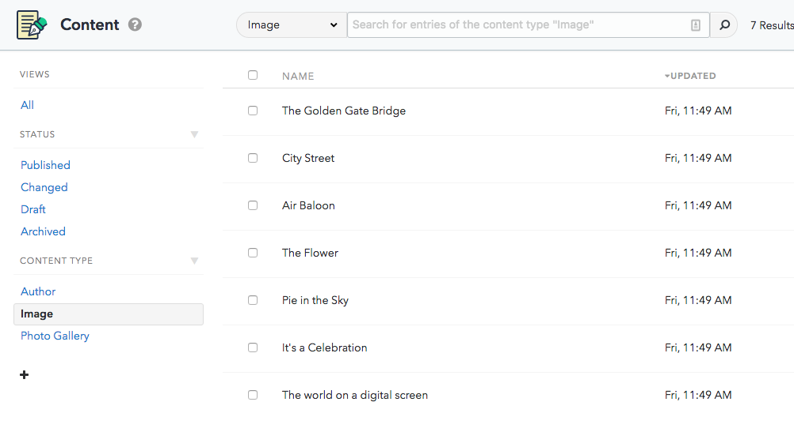
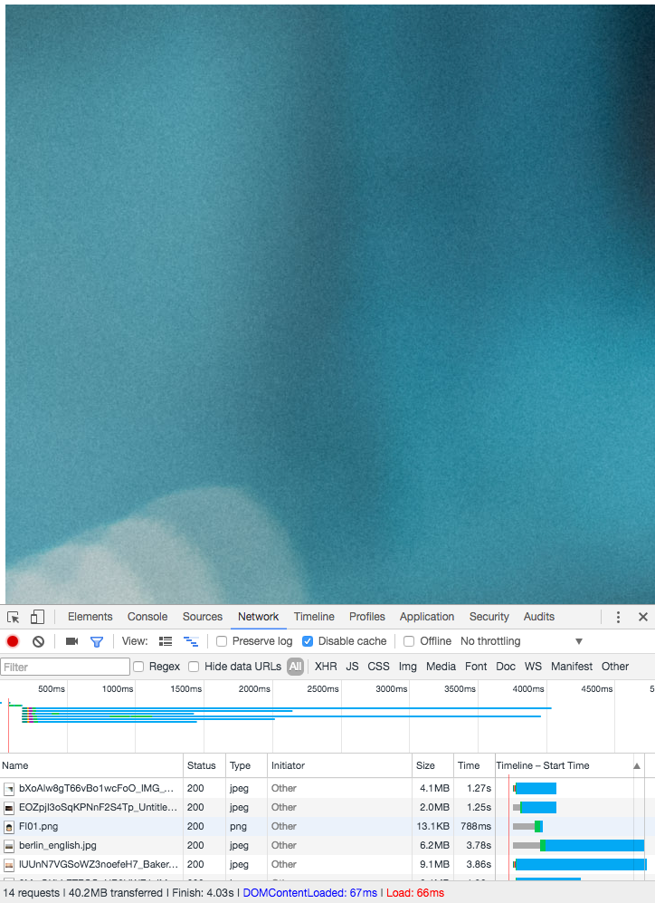
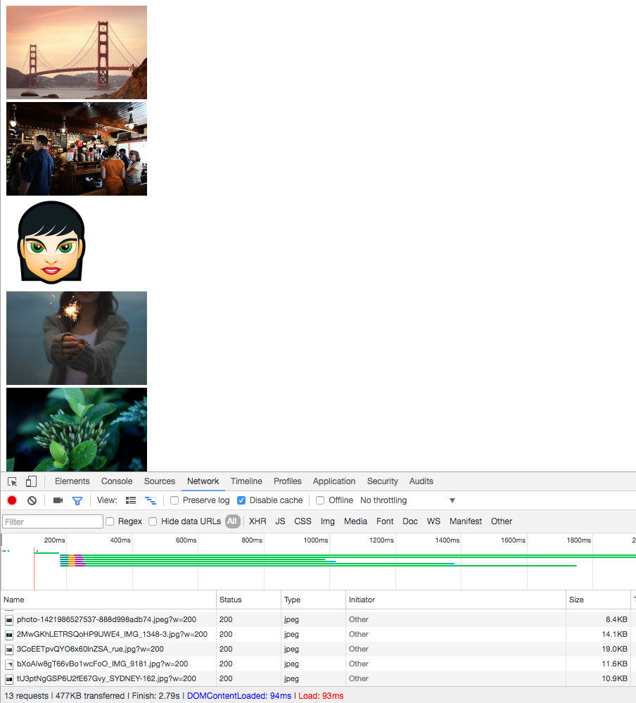
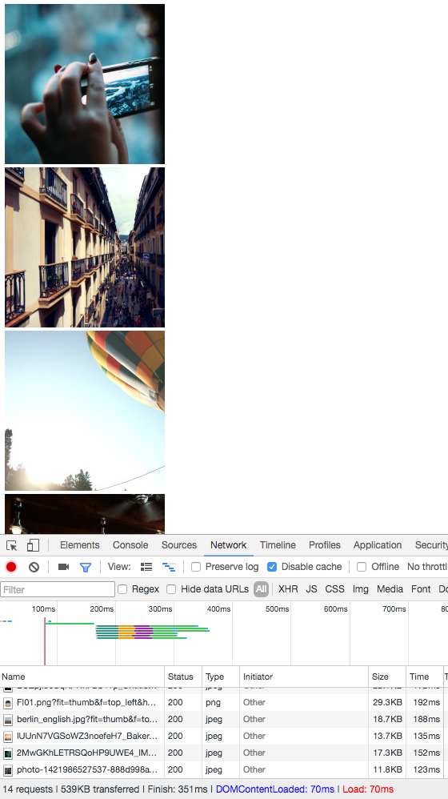

# temp

Images are a powerful way of explaining concepts, attracting a readers attention and creating an impact. Contentful has a seperate [Images API](/developers/docs/references/images-api/) that not only helps you retrieve image files for your Spaces, but also offers manipulation features to make images look how you want.

To best understand how to manipulate images we recommend you create a space filled with content from the 'Photo Gallery' example space.


If you switch to the _Media_ tab you will see the images in the space, note that most of them are quite large, requesting and loading each of these into your app will be a significant network and memory hit, ideally you want to request images at the size you need them.

Typically images are retrieved from [the context of one or more entries](/developers/docs/references/content-delivery-api/#/reference/links), or by [calling assets directly](/developers/docs/references/content-delivery-api/#/reference/assets). To make it clearer we will use a small JavaScript application to show Contentful's image features.



## Retrieve assets and image url

Read [how to setup and authenticate a JavaScript app](/developers/docs/javascript/tutorials/using-js-cda-sdk/), and then fetch the assets from the space, constructing a url for the image file.

```javascript
client.getAssets({})
  .then(function (assets) {
    assets.items.forEach(function (asset) {
      var imageURL = 'https:' + asset.fields.file.url;
    });
  })
  .catch(function (e) {
    console.log(e);
  });
```

Create a skeleton _index.html_ file to display the images.

```html
<!DOCTYPE html>
<html lang="en">
<head>
    <script src="bundle.js"></script>
    <meta charset="UTF-8">
    <title>Images Example</title>
</head>
<body>
<div id="images">

</div>
</body>
</html>
```

## Populate page with images

Inside the `forEach` loop, create an `image` element for each asset, `div` elements to contain them, and populate the `images` div with them.

```javascript
...
assets.items.forEach(function (asset) {
  var imagesDiv = document.getElementById('images');
  var imageURL = 'https:' + asset.fields.file.url;
  var imageDiv = document.createElement("div");
  var imageFile = document.createElement("img");
  imageFile.src = imageURL;
  imageDiv.appendChild(imageFile);
  imagesDiv.appendChild(imageDiv);
});
...
```

This results in a page of large images, in terms of dimensions and file size.



Now you have the structure ready, it's time to experiment.

## Resizing images

Let's resize the images by adding a parameter to the image url that sets a width, but will also maintain aspect ratio.

```javascript
...
assets.items.forEach(function (asset) {
  ...
  var imageURL = 'https:' + asset.fields.file.url + '?w=200';
  ...
});
...
```



Setting both the width and height of an image will still maintain the aspect ratio, so the code below will generate the same output as the previous example.

```javascript
...
assets.items.forEach(function (asset) {
  ...
  var imageURL = 'https:' + asset.fields.file.url + '?w=200&h=200';
  ...
});
...
```

If you want to override this behavior, you can use the `fit` parameter to control what part of the image Contentful returns.

This example creates a thumbnail of the image from the top left corner of the image.

```javascript
...
assets.items.forEach(function (asset) {
  ...
  var imageURL = 'https:' + asset.fields.file.url + '?fit=thumb&f=top_left&h=200&w=200';
  ...
});
...
```



The `fit` parameter can take other values to change this behaviour, [read more about what's possible in the API guide](/developers/docs/references/images-api/#/reference/resizing-&-cropping).

## What's next

There's more possible with the Images API such as adding rounded corners and background images, and changing the file format, all dynamically as you request the image.
