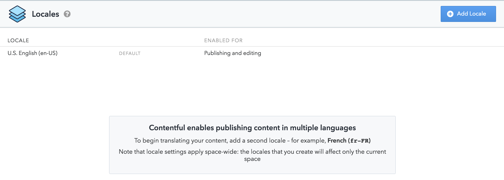
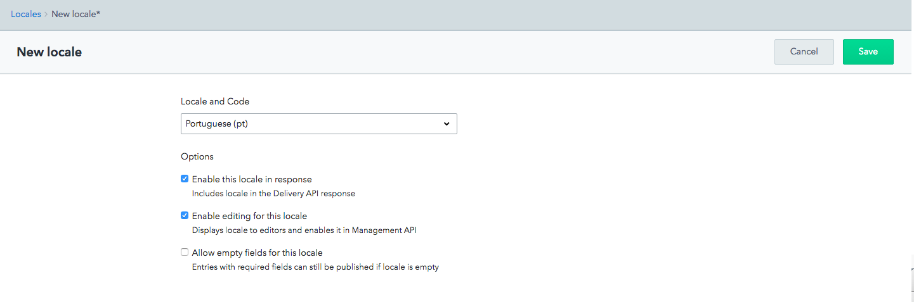
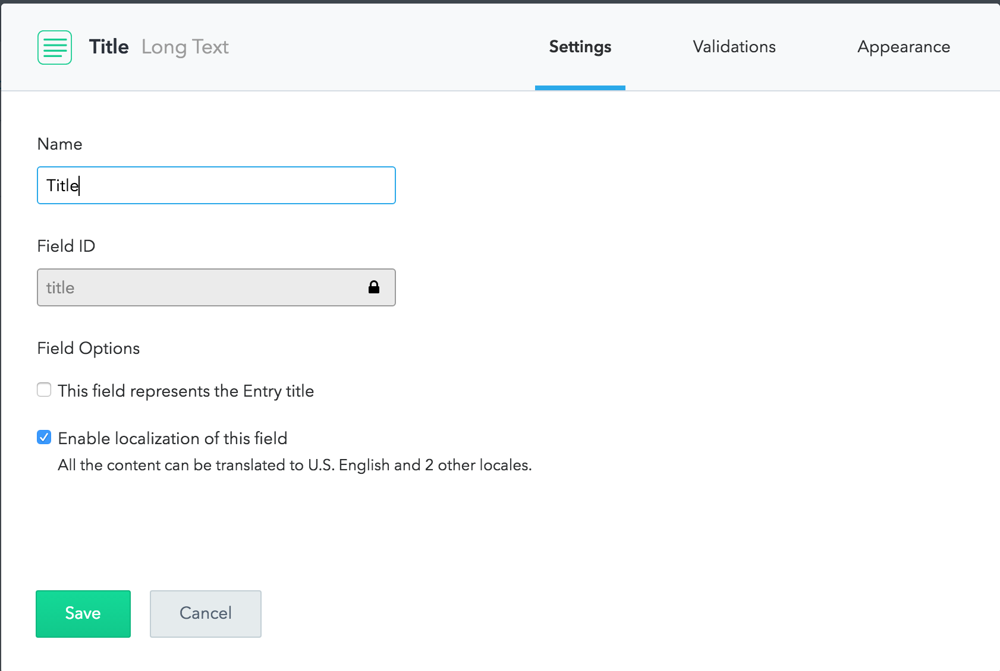
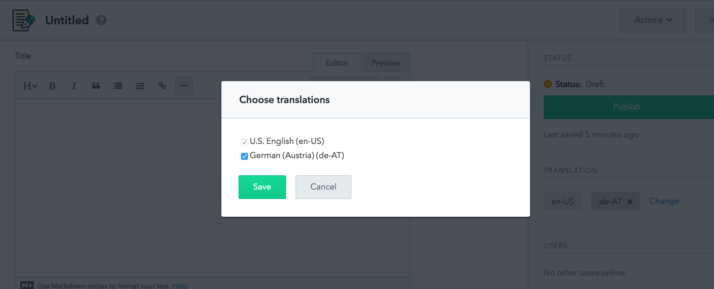
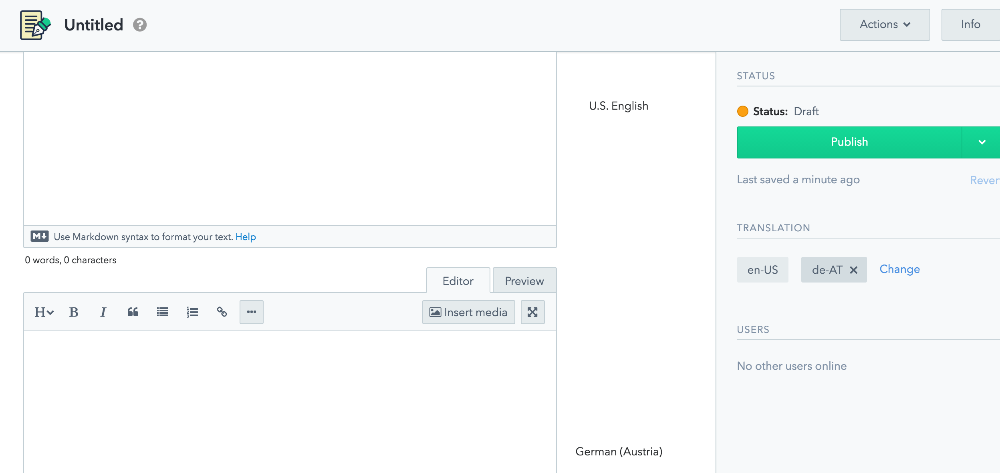

Locales are a feature of Contentful's [paid plans](https://www.contentful.com/pricing/). If you are working with content that needs to be available in multiple languages, locales let you define localizations of content and select a specific locale when querying the Content Delivery API.

Every Space has its own set of locales, and each locale is uniquely identified by its ISO code (e.g., `en-US` or `de-AT`). There's always one default locale defined when you create a space, shown by default in the Contentful web app and used for Content Delivery API queries that do not request a specific locale.

**Note**: As a space specifies a default locale, it's permanent and you cannot change it afterwards.

## Adding a locale

You can add a new locale to a space in the Contentful web app or by using the Content Management API.

### With the Web App

To add a locale in the web app, open _Settings -> Locales_ and click _Add locale_:

{:.img}

Choose a locale and its options:

{:.img}

### With the API

If you are writing scripts or applications, use the [Content Management API](https://www.contentful.com/developers/docs/references/content-management-api/#/reference/locales) to add a locale to a space use the following POST request with the name and ISO code contained within the body:

~~~bash
curl -X POST
  -H "Authorization: Bearer <CONTENT_MANAGEMENT_KEY>"
  -H "Content-Type: application/vnd.contentful.management.v1+json"
  -d '{
   "name":"English (British)",
   "code":"en-GB"
}'
"https://api.contentful.com/spaces/<SPACE_ID>/locales"
~~~

There are a couple of other options you can send with the API call, [read our API documentation](/developers/docs/references/content-management-api/#/reference/locales/locale-collection/create-a-locale) to find out more.

## Locales and fields

After adding a locale to a space, you can define which fields in your content types you want localized. You can do this with the web app or the Content Management API.

### With the Web App

To enable localization of a field in the web app, check the corresponding option in the field settings:

{:.img}

### With the API

It's possible to use the [Content Management API](/developers/docs/references/content-management-api/#/reference/content-types/content-type) to update content types and localize fields.

The following PUT request enables localization for the fields `productName` and `productDescription` of the content type `Product` by setting their `localized` property to `true`:

~~~bash
curl -X PUT
  -H "Authorization: Bearer <CONTENT_MANAGEMENT_KEY>"
  -H "Content-Type: application/vnd.contentful.management.v1+json"
  -d '{
  "name": "Product",
  "displayField": "productName",
  "fields": [
    {
      "name": "Description",
      "id": "productDescription",
      "type": "Text",
      "localized": true,
      "validations": []
    },
    {
      "name": "Product name",
      "id": "productName",
      "type": "Text",
      "localized": true,
      "validations": []
    },
    // Other fields in content type
  ]
}'
"https://api.contentful.com/spaces/<SPACE_ID>/content_types/<CONTENT_TYPE_ID>"
~~~

**Note**: The example above doesn't show all fields in the content type, but you need to include all, even those that you are not changing.

Next, select which translations will be available for each entry:

{:.img}

After this step, entries will have different field values for each locale:

{:.img}

## Retrieving entries without a specific locale

If you don't specify a locale in your request, you will receive the entry from the default locale (`en-US` in this example):

~~~bash
curl -X GET "https://cdn.contentful.com/spaces/<SPACE_ID>/entries/<ENTRY_ID>?access_token=<CONTENT_DELIVERY_KEY>"
~~~

### Retrieving entries with a specific locale

If you want to retrieve fields from a specific locale (e.g `de-AT`), use the `locale=de-AT` parameter in your request:

~~~bash
curl -X GET "https://cdn.contentful.com/spaces/<SPACE_ID>/entries/<ENTRY_ID>?access_token=<CONTENT_DELIVERY_KEY>&locale=de-AT"
~~~

### Retrieving all translations for an entry

You can retrieve all localized versions of an entry by using the 'wildcard' `locale=*` parameter:

#### URL of request

~~~bash
curl -X GET "https://cdn.contentful.com/spaces/<SPACE_ID>/entries/<ENTRY_ID>?access_token=<CONTENT_DELIVERY_KEY>&locale=*"
~~~

## Locales and the Sync API

No matter which locale you specify, the [synchronization API](https://www.contentful.com/developers/docs/concepts/sync/) always includes all localized content, using the same structure as the wildcard locale option above:

### URL of request

~~~bash
curl -X GET "https://cdn.contentful.com/spaces/<SPACE_ID>/entries/<ENTRY_ID>sync?initial=true?access_token=<CONTENT_DELIVERY_KEY>&locale=de-AT"
~~~
