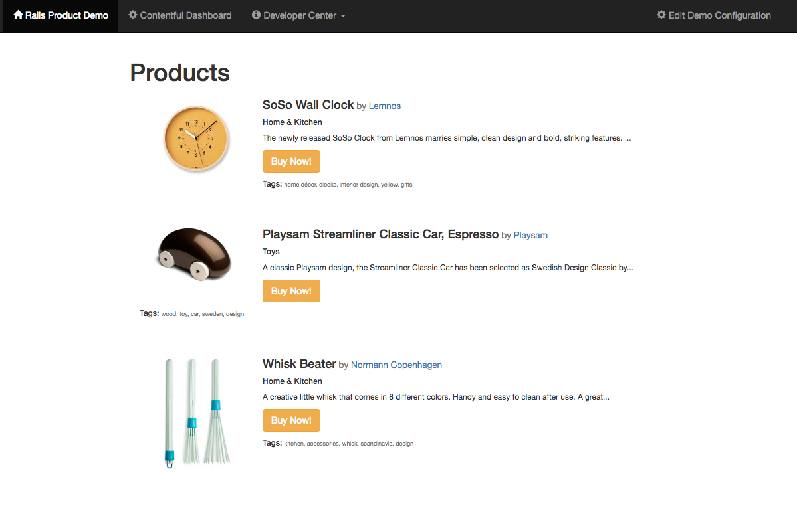
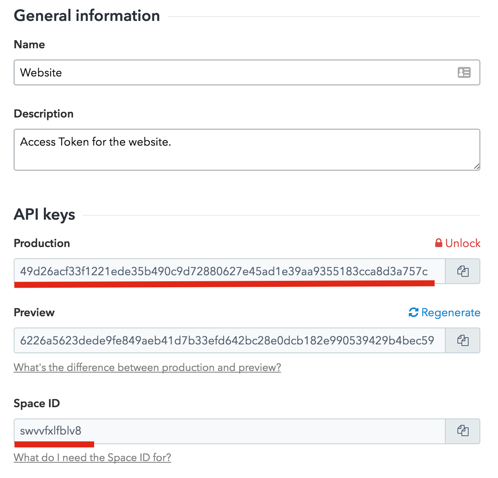
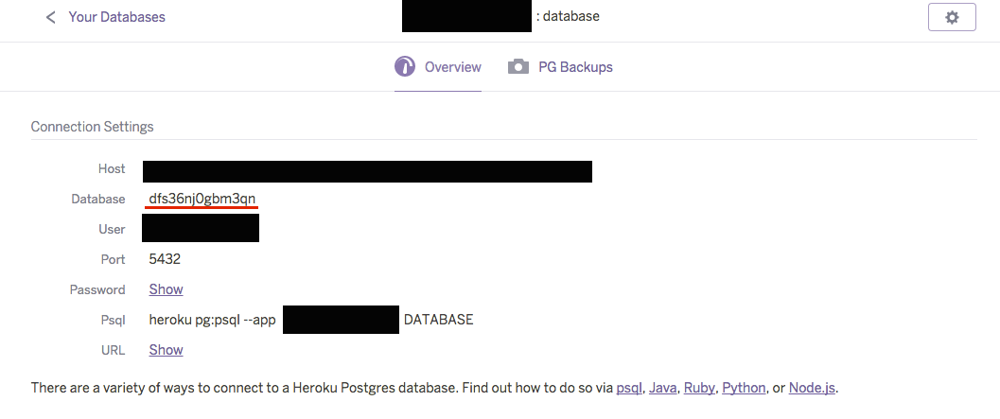

This guide will walk you through your first steps using Contentful within a Rails application. It will provide a step-by-step guide on how to get your first entries and start using the content you create on Contentful.

## Requirements

- A [Heroku][8] account
- Ruby 2.3.1 (via [RVM][16] or [rbenv][17])
- [Postgres][18] installed
- [Git][19] installed
- Basic Command Line Interface, Ruby and Rails knowledge

## Start from a demo application

First we'll start with a [demo project][10], which is a simple Rails application using Contentful's 'Product Catalogue' template, so that you can see it running for yourself.

Run the following commands to get started.

- Clone the example repository:

```bash
git clone https://github.com/contentful/contentful_rails_tutorial.git
```

- Navigate into the repository's directory:

```bash
cd contentful_rails_tutorial
```

- Install dependencies:

```bash
bundle install
```

- Install a default Contentful database configuration:

```bash
bundle exec rake db:create db:migrate db:seed
```

- Run the server:

```bash
bundle exec rails s
```

Everything is now set up. You can view your new data by opening [_http://localhost:3000/contentful_users/1_][11] in your browser

It should look something like this:



### Using your own content

You can create your own custom data by following these steps:

- Create an Account with [Contentful][12] or [Log In][13].
- Create a new Space with the 'Product Catalogue' template, name it whatever you like.
- In the Rails application:

  - Click the _Edit Demo Configuration_ button on the top navigation bar.
  - Click the _New Contentful Configuration_ button and fill in the form as follows:

    - _Configuration name_: Choose a name for your configuration.
    - _Space_: Add the value from _[the Contentful web app][13] > APIs > Content delivery/preview keys > Website key > Space ID_.
    - _Access token_: Add the Production Delivery API Access Token from _[the Contentful web app][13] > APIs > Content delivery/preview keys > Website key > Production_.
    - _Content type_: Add the Product's Content Type ID from _[the Contentful web app][13] > APIs > Content model explorer > Product > Identifier_.

  - Your space will be now displayed in your application



Next in the _[Contentful web app][13] > Content_:

- Open the product called 'Playsam Streamliner Classic Car, Espresso'.
- Change the value of the _Product name_ field to a new value,
- Click the _Publish changes_ button.
- Wait a few seconds for the changes to propagate to the CDN.
- Reload your Rails application and you will see the new product name.

You can continue to edit your content inside the [Contentful web app][13] and see the content change inside your Rails application.

### Deploy the demo to Heroku

To view the demo application live in your own production environment, follow these steps:

- Install the [Heroku toolbelt](https://devcenter.heroku.com/articles/heroku-command-line#download-and-install) if you don't already have it.
- Login to Heroku if you're not already:

```bash
heroku login
```

- Create a new instance:

```bash
heroku create
```

- Create a Postgres database:

```bash
heroku addons:create heroku-postgresql:hobby-dev
```

- Update the _config/database.yml_ file:

Replace `VALUE_OBTAINED_FROM_YOUR_HEROKU_PG_CONFIG` with the database name in your [Heroku Database's Dashboard][20]. You can find the name at _[Heroku Database Dashboard][20] > Your Postgres instance > Database_.



- Commit your change:

```bash
git add .
git commit -m "Update Database Configuration"
```

- Deploy to Heroku:

```bash
git push heroku master
```

- Install your default Contentful configuration:

```bash
heroku run env bundle exec rake db:migrate db:seed
```

- Open the application in your browser:

```bash
heroku open
```

## Next Steps

After this guide, you should be able to start using Contentful with your Rails applications, but every project has different needs and we want to provide you with the best solutions we can.

You can read about the Contentful CDA library in more detail on our [contentful.rb GitHub][1] or our [Getting Started with CDA SDK tutorial][15], we also suggest taking a look at our [Contentful Rails Example Application][10].

If you want to create your own Rails project we recommend following this [tutorial][14], or our Rails integration libraries [`contentful_model`][2] and [`contentful_rails`][3], which provide a more Rails-like approach to creating Contentful based applications.

Do you like building static sites? Check how to build static sites using Contentful with [Middleman][4] or [Jekyll][5].

If you want to set up new spaces via the command line we also provide [Contentful Bootstrap][6].

[1]: https://github.com/contentful/contentful.rb
[10]: https://github.com/contentful/contentful_rails_tutorial
[11]: http://localhost:3000/contentful_users/1
[12]: https://www.contentful.com/sign-up/#starter
[13]: https://app.contentful.com
[14]: /developers/docs/ruby/tutorials/create-your-own-rails-app/
[15]: /developer/docs/ruby/tutorials/getting-started-with-contentful-and-ruby/
[16]: https://rvm.io/rvm/install
[17]: https://github.com/rbenv/rbenv#installation
[18]: https://wiki.postgresql.org/wiki/Detailed_installation_guides
[19]: https://git-scm.com/book/en/v2/Getting-Started-Installing-Git
[2]: https://github.com/contentful/contentful_model
[20]: https://postgres.heroku.com/databases
[3]: https://github.com/contentful/contentful_rails
[4]: https://github.com/contentful/contentful_middleman_examples
[5]: https://github.com/contentful/contentful_jekyll_examples
[6]: https://github.com/contentful/contentful-bootstrap.rb
[7]: /developers/docs/references/content-delivery-api/#/reference/search-parameters
[8]: https://heroku.com
[9]: https://devcenter.heroku.com/articles/getting-started-with-rails4
