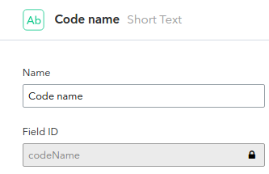

# Offline persistence with Vault on Android

In this tutorial we will walkthrough the essential steps of settings up Vault with your Android project. For that, we've open-sourced [DroidStory][droidstory], which is a simple app showcasing several best practices for integrating Vault in an Android project.

# Getting Started

Vault is split into two artifacts - `compiler` and `runtime`. The compiler is only required at compile time, and should not be bundled with the final APK. To achieve that, we first need to setup the [android-apt] Gradle plugin. The plugin not only lets us declare compile time only dependencies, but it also increases visibility for the generated classes inside IntelliJ/Android Studio.

First, we add the following to the `dependencies` block of our main [build.gradle][bgradle-main] file:

~~~groovy
classpath 'com.neenbedankt.gradle.plugins:android-apt:1.6'
~~~

Next, apply the plugin in the project's [build.gradle][bgradle-app] file (right after the android plugin):

~~~groovy
apply plugin: 'com.neenbedankt.android-apt'
~~~

And last, we declare Vault's dependencies:

~~~groovy
apt 'com.contentful.vault:compiler:0.9.9'
compile 'com.contentful.vault:core:0.9.9'
~~~

Make sure you're using the latest version of Vault, which is available on the official [GitHub repository][vault].
Now that we have our dependencies ready to go, let's move over to the code.

# Models, Fields and Space

The DroidStory space has a single content type, `Story`, which contains the following fields:

In order to create a Vault model corresponding to this type, we need to create a class, which extends the `Resource` class. We use the `@ContentType` and `@Field` annotations from Vault to give the library hints about the relevant pieces. Let's look at [Story.java][story_java] as an example:

~~~java
@ContentType("5RFNQmUj5Y6aAggqAswiqK")
public final class Story extends Resource {
  @Field String codeName;
  @Field Double version;
  @Field String releaseDate;
  @Field Integer apiLevel;
  @Field List<Asset> images;
  @Field String teaser;

  // ... getters omitted for brevity.
}
~~~

Notice that long value `5RFNQmUj5Y6aAggqAswiqK`? That's the ID of the `Story` content type. If you already know how to find it, move over to the next section. Otherwise, simply log-in to the Contentful web application, hit the `Content Types` button on the top bar, select the desired content type, and copy the last path segment of the URL.

`@Field` elements are automatically mapped when the name of the variable matches the field ID, you can find the field ID with the web user-interface:

`@Field` elements can point to other resources, this is what we call links/references. Since the `images` field is a reference to many `Media` resources, we declare it as a `List`. Later when we use Vault to fetch these resources as objects, the links will be automatically resolved.

Now that our model is defined, we need to bundle it into a space, which is the glue that ties multiple models together. Here's the code for [DroidStorySpace.java]:

~~~java
@Space(
    value = "7hqxd0h2npta", 
    models = { Story.class }, 
    locales = { "en-US" }
)
public final class DroidStorySpace { }
~~~

A space is just an empty class, annotated with `@Space`. We provide it with:
- `value` - ID of the space.
- `models` - Array of model classes.
- `locales` - Array of locales.

# Synchronization

Vault uses the Sync API to get delta updates for your spaces. This means that only the relevant bits will be transferred whenever you trigger synchronization. It is up to you to decide when is the best time to do so. Here's how to trigger it:

~~~java
// Get instance of Vault
Vault vault = Vault.with(context, DroidStorySpace.class);

// Create instance of CDAClient (use a singleton!)
CDAClient client = CDAClient.builder()
    .setSpace("space-id")
    .setToken("delivery-api-token")
    .build();

// Trigger sync
vault.requestSync(SyncConfig.builder().setClient(client).build());
~~~

In the DroidStory app, we use a [retained fragment][retained_fragment] named [StoryFragment.java][storyfragment_java]. Since activities get destroyed and re-created through configuration changes (e.g. orientation), a retained fragment is one way of having data live-through those events. A retained fragment's `onCreate()` method will be invoked only once, that's why we call `requestSync()` [right there][storyfragment_requestsync], ensuring the data will be refreshed whenever that screen shows up for the first time through the lifetime of a process. In addition, sync is trigged with a pull to refresh gesture inside [StoryActivity.java][storyactivity_ptr].

There are several ways to get notified once sync is finished, you can use broadcasts, callbacks or RxJava observables. But who wants to deal with broadcasts/callbacks anyway? With RxJava:

~~~java
Vault.observeSyncResults()
    .observeOn(AndroidSchedulers.mainThread())
    .subscribe(syncResult -> {
      // handle result
    });
~~~

# Queries

Making a query is as simple as:

~~~java
List<Story> stories = vault.fetch(Story.class).all();
~~~

For every model class, there's a `$Fields` generated class, which can be used to refer to fields when making queries:

~~~java
Story story = vault.fetch(Story.class)
    .where(Story$Fields.CODE_NAME + " = ?", "Lollipop")
    .first();
~~~

Order can be specified with the `order()` method:

~~~java
List<Story> stories = vault.fetch(Story.class)
    .order(Story$Fields.API_LEVEL + " DESC")
    .all();
~~~

Note that the `fetch()` method is synchronous, and will perform IO on the calling thread. In order to offload this work to a background thread, and collect the result back on the main thread, we can use the built-in support for RxJava:

~~~java
vault.observe(Story.class)
    .all()
    .subscribeOn(Schedulers.io())
    .observeOn(AndroidSchedulers.mainThread())
    .subscribe(story -> {
      // ...
    });
~~~

# Using your own space

In this repository you'll also find [droidstory-space-creator][dsc], a small node.js package to create your own copy of the DroidStory space. The syntax for the program is as follows:

~~~
  Usage: index <src_space_id> <src_cda_token> <cma_token>

  Options:

    -h, --help         output usage information
    -V, --version      output the version number
    -o, --org-id <id>  Target organization ID
~~~

Your management API token can be aquired through [the CMA documentation website][cma_docs]. Once you've obtained the token, execute the following:

~~~ sh
node droidstory-space-creator/index 7hqxd0h2npta 8534526702014a2680fffca1a35b1e0ce5d75a95c5e96464ac438c6c342ca37e YOUR-CMA-TOKEN
~~~

The ID of the new space should be printed, like so:
> All done, space ID:  xxxxxxxxxx

Update the space ID in [Config.java][config_java], and add your CDA access token to the [config.xml][config_xml] file.

Next we need to invalidate the previous data, as it belongs to the old space. To do that we can either uninstall the app, or set the `dbVersion` number to `2` on the `@Space` annotation in [DroidStorySpace.java][droidstoryspace_java]. Doing so invalidates any pre-existing data and essentially re-creates the database the first time it is used. 

Now that we're through with configurations, you can create new entries or update any existing ones. Use the pull to refresh gesture to re-sync, and watch as the content updates.

# Conclusion

Hopefully by now you know how to:

- Setup Vault in an Android project.
- Define models.
- Create a space.
- Trigger synchronization on-demand.
- Observe synchronization results.
- Make queries and fetch resources from Vault's local storage.

Make sure to check out the complete source-code for DroidStory, which is [available on GitHub][droidstory].

If you have any questions or feedback, please feel free to drop us an email to support@contentful.com.

[droidstory]: https://github.com/contentful-labs/droidstory
[bgradle-main]: https://github.com/contentful-labs/droidstory/blob/master/droidstory-android/build.gradle
[bgradle-app]: https://github.com/contentful-labs/droidstory/blob/master/droidstory-android/app/build.gradle
[vault]: https://github.com/contentful/vault
[story_java]: https://github.com/contentful-labs/droidstory/blob/master/droidstory-android/app/src/main/java/com/contentful/droidstory/data/vault/Story.java
[retained_fragment]: http://developer.android.com/guide/topics/resources/runtime-changes.html#RetainingAnObject
[storyfragment_java]: https://github.com/contentful-labs/droidstory/blob/master/droidstory-android/app/src/main/java/com/contentful/droidstory/ui/story/StoryFragment.java
[storyfragment_requestsync]: https://github.com/contentful-labs/droidstory/blob/master/droidstory-android/app/src/main/java/com/contentful/droidstory/ui/story/StoryFragment.java#L53
[storyactivity_ptr]: https://github.com/contentful-labs/droidstory/blob/master/droidstory-android/app/src/main/java/com/contentful/droidstory/ui/story/StoryActivity.java#L72
[config_java]: https://github.com/contentful-labs/droidstory/blob/master/droidstory-android/app/src/main/java/com/contentful/droidstory/data/Config.java#L23
[config_xml]: https://github.com/contentful-labs/droidstory/blob/master/droidstory-android/app/src/main/res/values/config.xml#L3
[droidstoryspace_java]: https://github.com/contentful-labs/droidstory/blob/master/droidstory-android/app/src/main/java/com/contentful/droidstory/data/vault/DroidStorySpace.java#L22
[dsc]: https://github.com/contentful-labs/droidstory/tree/master/droidstory-spacecreator
[cma_docs]: http://docs.contentfulcma.apiary.io

